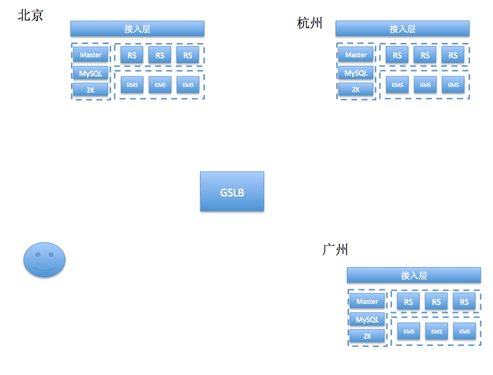

# 解决方案

## 一. 需求概述
1. 直播：秒开，卡顿率，CDN调度，视频质量
2. 游戏：并发，socket解决方案，qps瓶颈，稳定性
3. 业务解藕，集群部署调度方案，数据库选型与安全

## 二. 方案概述

### 直播
#### 秒开
>大部分播放器都是拿到一个完成的 GOP 后才能解码播放，基于 FFmpeg 移植的播放器甚至需要等待音画时间戳同步后才能播放（如果一个直播里边没有音频只有视频相当于要等待音频超时后才能播放画面）。

**“秒开”可以从以下2个方面考虑:**

**1.改写播放器逻辑让播放器拿到第一个关键帧后就给予显示**。

GOP 的第一帧通常都是关键帧，由于加载的数据较少，可以达到 “首帧秒开”。

如果直播服务器支持 GOP 缓存，意味着播放器在和服务器建立连接后可立即拿到数据，从而省却跨地域和跨运营商的回源传输时间。

GOP 体现了关键帧的周期，也就是两个关键帧之间的距离，即一个帧组的最大帧数。假设一个视频的恒定帧率是 24fps（即1秒24帧图像），关键帧周期为 2s，那么一个 GOP 就是 48 张图像。一般而言，每一秒视频至少需要使用一个关键帧。

增加关键帧个数可改善画质（GOP 通常为 FPS 的倍数），但是同时增加了带宽和网络负载。这意味着，客户端播放器下载一个 GOP，毕竟该 GOP 存在一定的数据体积，如果播放端网络不佳，有可能不是能够快速在秒级以内下载完该 GOP，进而影响观感体验。

如果不能更改播放器行为逻辑为首帧秒开，直播服务器也可以做一些取巧处理，比如从缓存 GOP 改成缓存双关键帧（减少图像数量），这样可以极大程度地减少播放器加载 GOP 要传输的内容体积。

**2.在 APP 业务逻辑层面方面优化**

比如提前做好 DNS 解析（省却几十毫秒），和提前做好测速选线（择取最优线路）。经过这样的预处理后，在点击播放按钮时，将极大提高下载性能。

一方面，可以围绕传输层面做性能优化；另一方面，可以围绕客户播放行为做业务逻辑优化。两者可以有效的互为补充，作为秒开的优化空间。

### CDN调度
### 理想的架构

* SLB负责管理RS的存活状态

* 终端跟接入服务器通信 

* 一个RS退出后可以将Room转移到其他的RS上
>RS:room server（逻辑上房间概念）

a) 实现起来简单些，不过系统也要引入Zookeeper这样的组件，b）c)要配合在一起用才能发挥效果。

 

## GSLB 全局负载均衡

### ip地址库

使用ipip.net提供的地址库（nos已经购买了该服务），来计算终端所在的地域和运营商

### 策略模块

项目初期由于点不够多，还有需要对比使用webRTC推流到源站和使用rtmp推送的cdn的效果，因此要按照一定策略来选择接入的终端。比如可以选择杭州5%的用户来使用webrtc的推流方式，95%的用户仍然使用rtmp推送到cdn的方式。

### 探活模块

定时跟部署在全国的RS、KMS通信，获取它们的健康状态，将存活的RS、KMS写入到memcache里。

### memcache

存储源站的RS的存活、负载状态。

对于米趣现有的方案只能选择第二个方法。